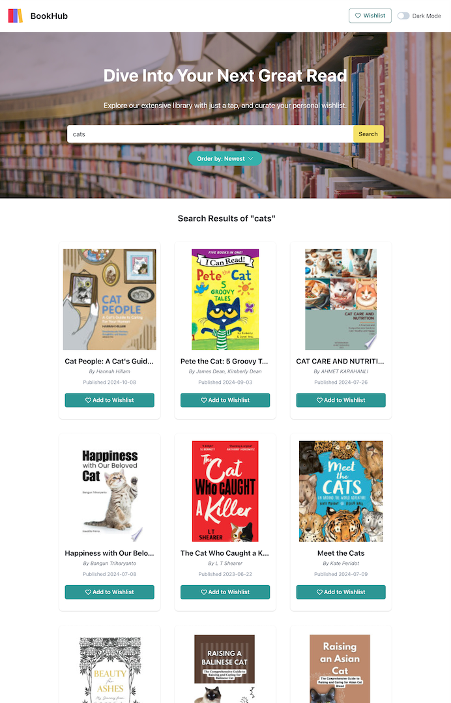

# BookHub

BookHub is a book discovery web app that allows users find new and interesting books to read. With BookHub, users can search for books by keywords, sort the search results by relevance and publication dates, read the book summary and add books to their wishlists. The app is built React, TypeScript, with styling achieved through Chakra UI. Data is fetched from Google Book API.

### Visit The Website

[BookHub](https://book-hub-nu-five.vercel.app/)

### Built with

- React.js
- TypeScript
- Google Book API
- Zustand - React state management library
- Chakra UI - Simple, modular and accessible component library

### Lessons learned

As my first solo React project, I applied the knowledge gained from the various React courses and tutorials that I've gone through. Through this, I have strengthened my foundations in React, particularly understanding the principle of single responsibility and component-based architecture.

Initially, I struggled in prop passing and how to properly structure the app, leading to a cluttered components. Once the core functionality was working, I refactored the code to enhance modularity. For example, I extracted data fetching logic into a custom hook to simplify component logic and make the components more resuable.

Additional takeways include:

- Form-based data fetching: Implementing data retrieval through form submissions.
- State management exploration: Evaluating options like React Query, Context, and Zustand.
- UI library integration: Utilising Chakra UI for efficient component styling.
- Employing React Router for navigation and component rendering based on URLs.

### Author

[Ellen Chan](https://ellenycc.github.io/portfolio/)
